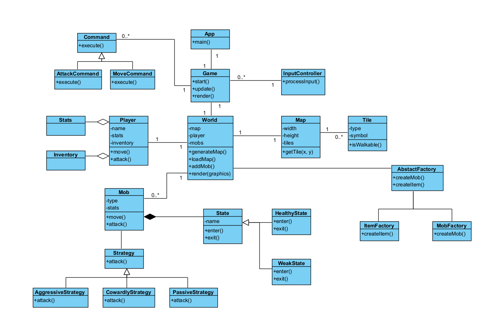

# Roguelike 

## Общие сведения об игре

* Жанр: Roguelike
* Вид: 2D, вид сверху
  
## Описание

Пошаговая roguelike игра с видом сверху, в которой игроки исследуют разнообразные уровни, борются с врагами и собирают предметы. Игра сочетает элементы стратегии и случайной генерации уровней.

## Цель игры

Пройти все уровни. В конце каждого уровня необходимо убить босса, после последнего уровня присутсвует несколько боссов.

## Игровые механики

* Пошаговая механика
* Все окружение генерируется на ходу, у разных уровней разные паттерны
* Несколько видов оружия
* Несколько видов постоянных улучшений
* Инвентарь
* В случае смерти прохождение начинается заново, но есть улучшения, которые сохраняются
* Пройти игру без этих улучшений практически невозможно

## Диаграмма классов

